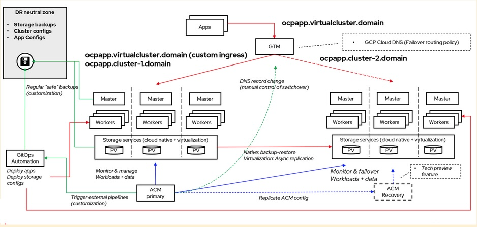
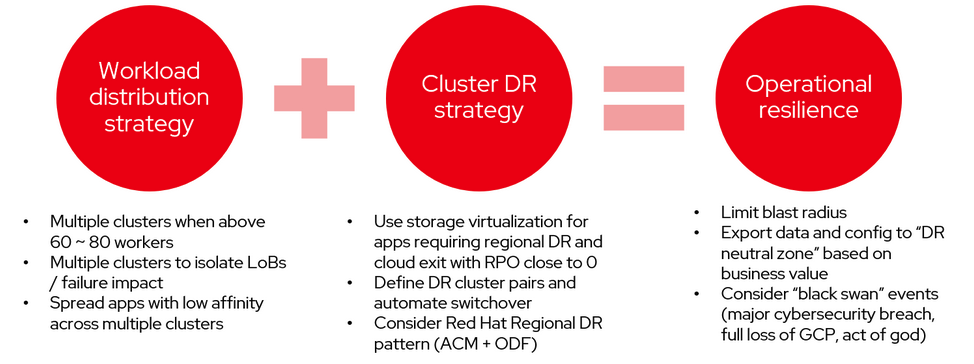
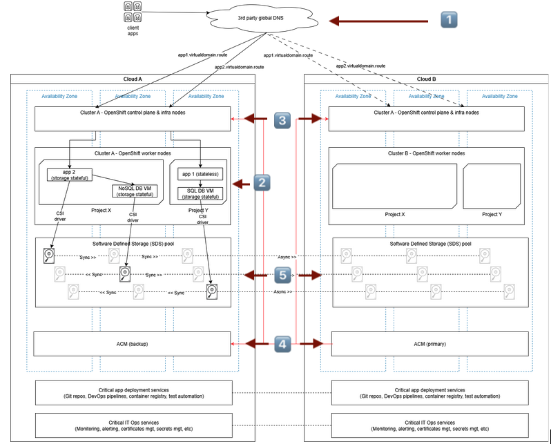
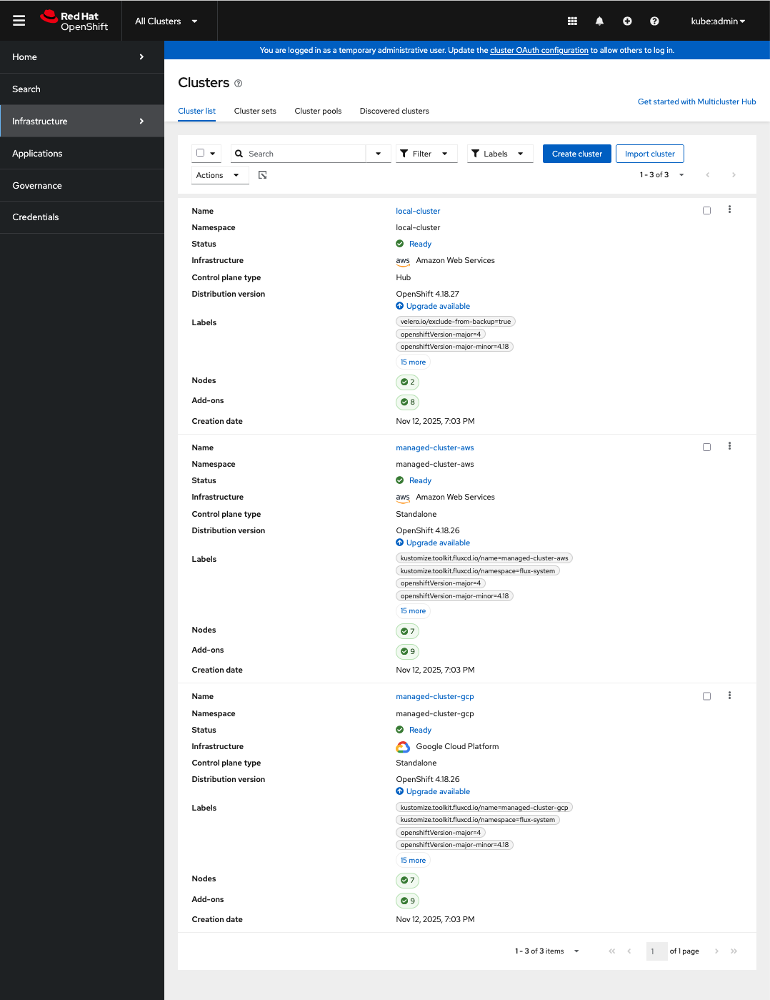
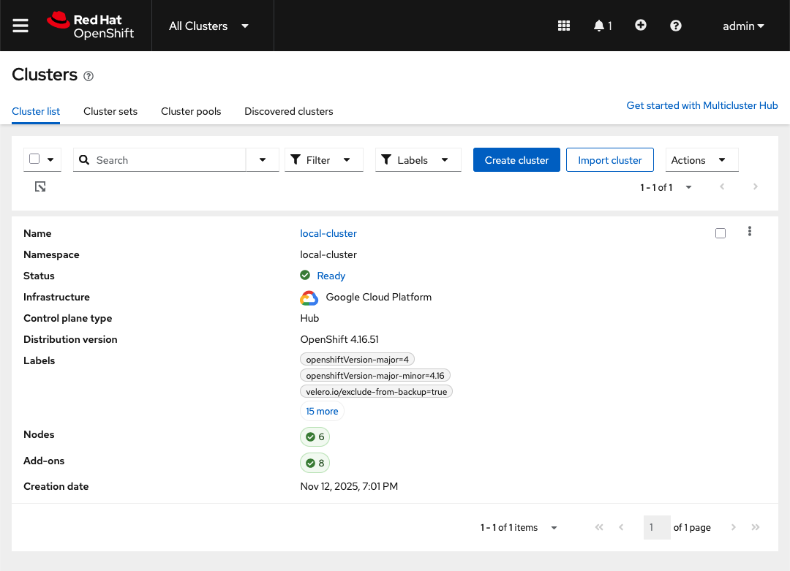
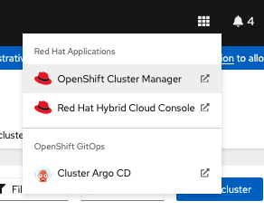
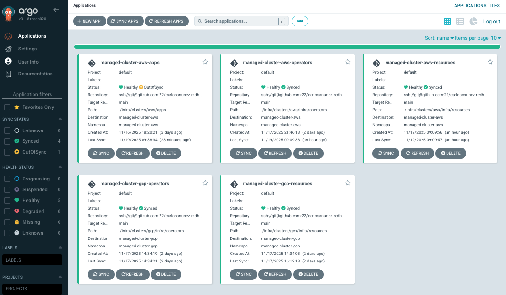

## OpenShift Multicloud Demo



In this demo, you'll explore how the OpenShift Container Platform, Red Hat
Advanced Cluster Management, Portworx Enterprise and CockroachDB work together
to seamlessly fail over applications and infrastructure across clouds.

Contact anyone in the [MAINTAINERS](./MAINTAINERS) file if you have questions
or need help.

- [Concepts](#concepts)
- [Setting up](#setting-up)
- [Deploy!](#deploy-the-environment)
- [Run the demo](#run-the-demo)
- [Teardown](#teardown)

## Concepts

> ✅ Skip to the ["Setting Up"](#setting-up) section if you want to start building.

### Abstract



Cloud platforms and cloud-native services have long enabled businesses to scale
their operations and "excite and delight" their customers with incredible speed
and efficiency.

They are not a panacea, however. This operational convenience comes at the cost
of platform and economic lock-in, singluar points of failure that require
additional engineering complexity to hedge against.  Unfortunately, companies
usually scramble frantically into performing this work after large
cloud-provider outages spark multi-million dollar business downtime.

Moreover, there is increasing pressure from regulators, like the European
Banking Authority and the UK FCA, for financial services providers to document
and test their "cloud exit" resiliency plans. Implementational differences
between cloud services, like clients of AWS Neptune vs Azure Cosmos, can make
complying with these regulations appear insurmountable.

Standardizing on open-source and container-native technologies substantially
solves these concerns. Platforms composed of open-source software frameworks and
tooling that run atop of a Kubernetes distribution, such as Red Hat OpenShift
Container Platform, give businesses more agility during industry-decimating
cloud outages, more leverage against unexpected price increases, and more
control over their data and privacy.

### Architecture



The architecture in this demo, shown above, describes one implementation of such
a platform.

In this implementation, applications are served out of two OpenShift clusters
across two clouds and accessed through DNS records served by a third party (1️⃣).
While AWS and Google Cloud are used in this demo environment, these can be on
any two cloud providers, on-premise datacenters or homelabs.

Applications are managed by GitOps through ArgoCD (2️⃣).  As this demo will illustrate,
cluster administrators and platform engineers can use GitOps to install,
configure and scale cluster components and their applications entirely with Git.
This approach simplifies operations while increasing auditability and
transparency.

The OpenShift clusters hosting the applications (3️⃣)  are provisioned by the
Multicluster Engine component of Red Hat Advanced Cluster Management (ACM) (4️⃣). ACM
provides a control plane for Kubernetes clusters, OpenShift or not. It enables
centralized cluster security, application management through ArgoCD and more.

Portworx Enterprise and CockroachDB provide replicated storage and database
across the two clusters (5️⃣). Both of these products make configuring replication
fast and simple. This enables applications to continue operations during outages
with a minimal RTO and small RPO, as we'll see in this demo when we "obliterate"
AWS and failover into Google Cloud.

## Setting up

### Prerequisites

- GnuPG (`brew install gnupg` or `dnf -y install gnupg`)
- sOPs (Visit [this
  page](https://github.com/getsops/sops?tab=readme-ov-file#1download) for
  installation instructions
- Existing OpenShift clusters in AWS and GCP (tested with 4.19)

### Instructions

#### SSH and GPG Setup

1. Fork this repository so that you can commit and push your changes.
   [Click
   here](https://github.com/carlosonunez/openshift-for-multicloud-demo/fork) to do that.

2. Create a GPG keypair, if you don't have one already. This will be used to
   encrypt Kubernetes secrets that will be used by your ACM hubs and their
   managed Kubernetes clusters, like cloud credentials and OpenShift install
   configs.

    ```sh
    gpg --quick-gen-key --batch --yes --passphrase '' your@email.address
    ```

3. Confirm that your key has been created by running the command below:

    ```sh
    gpg --list-keys your@email.address
    ```

    which should produce output similar to the below:

    ```sh
    gpg: checking the trustdb
    gpg: marginals needed: 3  completes needed: 1  trust model: pgp
    gpg: depth: 0  valid:   1  signed:   0  trust: 0-, 0q, 0n, 0m, 0f, 1u
    gpg: next trustdb check due at 2028-10-13
    pub   ed25519 2025-10-14 [SC] [expires: 2028-10-13]
          ABCDEF01234567890ABCDEF01234567890ABCDEF
    uid           [ultimate] your@email.address
    sub   cv25519 2025-10-14 [E]
    ```

4. Create an SSH key. This will be used by ArgoCD (and Flux, if configured) to clone this
   repository and deploy the ACM hubs and managed OpenShift clusters
   as well as our demo application and its dependencies.

    ```sh
    ssh-keygen -t rsa -f /tmp/id_rsa -q -N ''
    ```

#### Creating a config

The configuration for our ACM hubs, managed clusters, operators and apps lives
in `config.yaml` at the root of our repository. This file is encrypted with sOps
so that we can store our configuration securely alongside our clusters and
preserve changes made to it into our history.

Follow the steps below to create a new one.

1. Retrieve the kubeconfigs for the clusters in AWS and GCP that you'd like the
   ACM hubs in this demo environment to be hosted inside of.

2. Create a new config file from the example:

    ```sh
    rm config.yaml && cp config.example.yaml config.yaml
    ```

   **WARNING**: `config.yaml` is **NOT** ready to be modified securely yet.
   Follow the steps below to encrypt it first.

3. Run the command below to obtain the fingerprint for the GPG key that you created:

    ```sh
    gpg --list-keys --with-colons your@email.address | \
        grep fpr | \
        head -1 | \
        rev | \
        cut -f2 -d ':' | \
        rev
    ```

4. Open `.sops.yaml` in an editor and update the `pgp` keys in `.sops.yaml` with
   the fingerprint you obtained above.

5. Encrypt the `config.yaml` file that you created:

   ```sh
   sops encrypt --output config.yaml config.yaml
   ```

   This will not produce any output if it succeeds.

6. Run this command to verify that `config.yaml` was encrypted:

   ```sh
   sops filestatus config.yaml
   ```

   This should produce the output below:

   ```json
   {"encrypted":"true"}
   ```

   Congratulations! Your config is now encrypted and can be modified securely
   with `sops`.

7. We're now ready to update our config. Run `sops config.yaml` to open a
   decrypted copy of `config.yaml` in an editor, then make the following
   changes:

   - Set the `kubeconfig` key in the `gcp` environment to the kubeconfig of the
     OpenShift cluster in GCP that you'd like ACM to be hosted in.

   - Set the `kubeconfig` key in the `aws` environment to the kubeconfig of your
     OpenShift cluster in AWS that you'd like ACM to be hosted in.

   - The OpenShift cluster in AWS is the "primary" ACM hub that managed
     clusters and GitOps will be hosted out of. To change this, set
     `acm_config.role` to `primary` underneath the `gcp` environment and
     `acm_config.role` underneath the `aws` environment to `backup`.

   - Replace anything that says `change me` with actual values. See the comments
     above the keys for guidance on what to replace them with.

> 📝 **NOTE**
>
> You can also use [Flux](https://fluxcd.io) to bootstrap ACM components. Set
> the `bootstrapper` key underneath `common.bootstrap` to `flux` if you'd like
> to do this.

## 🛫 Deploy the Environment

Update any secrets in the repo if this is the first time you're running this
demo:

```sh
# Add --help to see what else you can do with this script.
./deploy.sh --regenerate-secrets --secrets-only
```

Commit and push your changes, then run the deploy script again:

```sh
# Add --help to see what else you can do with this script.
./deploy.sh
```

This will do the following:

- Replace Kubernetes secrets encrypted with the upstream project's GPG key with
  Secrets created with your GPG key,

- Create an AWS S3 bucket to store backups of your ACM hub that will be used for
  the "ACM failover" part of this demo ([Ansible
  task](./tasks/create_backup_s3_bucket.yaml))

- Install either [ArgoCD](./tasks/install_argocd.yaml) or
  [Flux](./tasks/install_fluxcd.yaml) into the "primary" and
  "backup" ACM hubs.

- Create the [ArgoCD Application](./tasks/configure_acm_hubs_argocd.yaml) or
  [Flux GitRepository and Kustomization](./tasks/configure_acm_hubs_flux.yaml)
  needed to synchronize this repository with your ACM hub using the SSH key you
  created earlier.

- Wait 45 minutes for ACM to create managed OpenShift clusters in AWS and GCP
  ([Ansible task](./tasks/wait_until_managed_clusters_ready.yaml))

- Add ingress rules to the AWS Security Group for the managed cluster in AWS and
  the GCP Firewall for the managed cluster to allow Portworx and CockroachDB
  pods to talk to each other across regions ([Ansible
  task](./tasks/modify_managed_cluster_security_groups.yaml)), and

- Create a [Portworx cluster
  pair](https://docs.portworx.com/portworx-enterprise/3.3/operations/disaster-recovery/async-dr/generate-apply-clusterpair)
  between the managed clusters in AWS and GCP to enable near-zero RPO asynchronous replicated
  storage ([Ansible task](./tasks/create_px_async_cluster_pair.yaml)).

- Create a failover CNAME DNS record in the AWS Route53 zone for the domain you
  set the `common.dns.settings.domain_name` key to in your `config.yaml`
  configuration file.

### Watching progress

The environment will take about an hour to provision.

ACM, ACM backups and the managed clusters in AWS and GCP are managed by ArgoCD
(by default) or Flux.

You can watch its progress by running the commands below:

#### ArgoCD

```sh
# `dnf -y install watch` or `brew install watch` if you get a
# "no such file or directory" error
watch -n 0.5 kubectl --kubeconfig /path/to/kubeconfig/for/primary/acm/hub \
    get clusterdeployment,applications.argoproj.io -A
```

#### Flux

```sh
# `dnf -y install watch` or `brew install watch` if you get a
# "no such file or directory" error
watch -n 0.5 kubectl --kubeconfig /path/to/kubeconfig/for/primary/acm/hub \
    get kustomization,clusterdeployment,applications.argoproj.io -A
```

You'll see something like the output shown below when this is done:

#### ArgoCD

```sh
Every 0.5s: kubectl get clusterdeployment,applications.argoproj.io -A

NAMESPACE             NAME                                                      INFRAID                     PLATFORM   REGION      VERSION   CLUSTERTY
PE   PROVISIONSTATUS   POWERSTATE   AGE
managed-cluster-aws   clusterdeployment.hive.openshift.io/managed-cluster-aws   managed-cluster-aws-42z4d   aws        us-east-2   4.18.26
     Provisioned       Running      63m
managed-cluster-gcp   clusterdeployment.hive.openshift.io/managed-cluster-gcp   managed-cluster-gcp-9fdlk   gcp        us-east1    4.18.26
     Provisioned       Running      63m

NAMESPACE          NAME                                                    SYNC STATUS   HEALTH STATUS
openshift-gitops   application.argoproj.io/bootstrap-acm-hub-primary       Synced     Healthy
openshift-gitops   application.argoproj.io/managed-cluster-aws-apps        Synced     Healthy
openshift-gitops   application.argoproj.io/managed-cluster-aws-operators   Synced     Degraded
openshift-gitops   application.argoproj.io/managed-cluster-aws-resources   Synced     Healthy
```


#### Flux

```sh
Every 0.5s: kubectl get kustomization,clusterdeployment,applications.argoproj.io -A  bastion.6jxv2.internal: Wed Nov 19 14:28:55 2025

NAMESPACE     NAME                                                                             AGE     READY   STATUS
flux-system   kustomization.kustomize.toolkit.fluxcd.io/argocd-server-options                  6d13h   True    Applied revision: refs
/heads/main@sha1:da287d3a66dd058bcc9b816bf1d90095c18b5cd4
flux-system   kustomization.kustomize.toolkit.fluxcd.io/cloud-installconfig-secrets-aws        6d13h   True    Applied revision: refs
/heads/main@sha1:da287d3a66dd058bcc9b816bf1d90095c18b5cd4
flux-system   kustomization.kustomize.toolkit.fluxcd.io/cloud-installconfig-secrets-gcp        6d13h   True    Applied revision: refs
/heads/main@sha1:da287d3a66dd058bcc9b816bf1d90095c18b5cd4
flux-system   kustomization.kustomize.toolkit.fluxcd.io/cluster-acm-clusterset                 6d13h   True    Applied revision: refs
/heads/main@sha1:da287d3a66dd058bcc9b816bf1d90095c18b5cd4
flux-system   kustomization.kustomize.toolkit.fluxcd.io/cluster-acm-hub                        6d13h   True    Applied revision: refs
/heads/main@sha1:da287d3a66dd058bcc9b816bf1d90095c18b5cd4
flux-system   kustomization.kustomize.toolkit.fluxcd.io/cluster-acm-mce                        6d13h   True    Applied revision: refs
/heads/main@sha1:da287d3a66dd058bcc9b816bf1d90095c18b5cd4
flux-system   kustomization.kustomize.toolkit.fluxcd.io/cluster-config                         6d13h   True    Applied revision: refs
/heads/main@sha1:da287d3a66dd058bcc9b816bf1d90095c18b5cd4
flux-system   kustomization.kustomize.toolkit.fluxcd.io/cluster-operators-acm                  6d13h   True    Applied revision: refs
# rest of kustomizations truncated

NAMESPACE             NAME                                                      INFRAID                     PLATFORM   REGION      VE
RSION   CLUSTERTYPE   PROVISIONSTATUS   POWERSTATE                   AGE
managed-cluster-aws   clusterdeployment.hive.openshift.io/managed-cluster-aws   managed-cluster-aws-kkk6q   aws        us-east-2   4.
18.26                 Provisioned       WaitingForClusterOperators   6d13h
managed-cluster-gcp   clusterdeployment.hive.openshift.io/managed-cluster-gcp   managed-cluster-gcp-5qbxp   gcp        us-east1    4.
18.26                 Provisioned       Running                      6d13h

NAMESPACE          NAME                                                    SYNC STATUS   HEALTH STATUS
openshift-gitops   application.argoproj.io/managed-cluster-aws-apps        Synced        Healthy
openshift-gitops   application.argoproj.io/managed-cluster-aws-operators   Synced        Healthy
openshift-gitops   application.argoproj.io/managed-cluster-aws-resources   Synced        Healthy
openshift-gitops   application.argoproj.io/managed-cluster-gcp-operators   Synced        Healthy
openshift-gitops   application.argoproj.io/managed-cluster-gcp-resources   Synced        Healthy

```

#### Verify the deployment

##### ACM

1. Get the routes for the OpenShift consoles in the primary and secondary ACM
   hubs:

```sh
console_primary=$(kubectl --kubeconfig /path/to/kubeconfig/for/primary/acm/hub get route \
    -n openshift-console console jsonpath='{.spec.host}')
console_backup=$(kubectl --kubeconfig /path/to/kubeconfig/for/backup/acm/hub get route \
    -n openshift-console console jsonpath='{.spec.host}')
echo "Primary: $console_primary"
echo "Backup: $console_backup"
```

2. In the primary ACM hub, verify that there are backups available in the S3
   bucket created during deployment:

   ```sh
   kubectl --kubeconfig .../primary/acm/hub get backups -A
   ```

   You should see a list similar to the below:

   ```sh
   NAMESPACE                        NAME                                            AGE
   open-cluster-management-backup   acm-credentials-schedule-20251119004415         13h
   open-cluster-management-backup   acm-managed-clusters-schedule-20251119004415    13h
   open-cluster-management-backup   acm-resources-generic-schedule-20251119004415   13h
   open-cluster-management-backup   acm-resources-schedule-20251119004415           13h
   open-cluster-management-backup   acm-validation-policy-schedule-20251119004415   13h
   # more backups omitted
   ```

3. Log into both OpenShift consoles. Change `local-cluster` to all clusters.

   In the "primary" ACM hub, verify that `managed-cluster-aws` and
   `managed-cluster-gcp` managed clusters are **Healthy**.

   

   In the "backup" ACM hub, there should be no clusters in this screen.

   

##### ArgoCD

1. In the primary ACM hub, click the tile menu on the upper-right corner, then
   click on "Cluster Argo CD".

    

2. You should be able to see synced resources after logging in with OpenShift.

    

    You're ready to go when all of the applications are in **Synced** and
    **Healthy** states.

    (Notice how there the managed cluster in GCP **does not** have any applications
    being synced into it. We will configure this when we simulate our failover.)

### 📝 Run the demo

#### Failing over

##### Check out the example app

Visit https://example-todo-app-example-todo-app.$YOUR_DOMAIN. You should see a
simple to-do app.

Create some todos. Cross out some others.

##### Start the failover script

Run the command below to initiate the failover:

```sh
./failover.sh
```

This will do the following:

- Wait for you to "take down" a region, which you'll do in the next step,
- Restore ACM configuration from your primary ACM hub into your backup hub,
- Enable the ArgoCD application that synchronizes our example to-do app into your
  "backup" managed cluster in GCP,
- Re-point the `app.$YOUR_DOMAIN` DNS record created earlier to your backup
  application.

##### Take primary down!

Pretty much the subject. Shutting down the EC2 nodes for your primary ACM hub
and managed clusters is the fastest way to do this, but be as creative as you
like!

##### Wait for the failover to complete

The failover script should start working a few seconds after your nodes go
offline. The failover should take a minute or two to complete.

##### Add more todos!

Re-visit `app.$YOUR_DOMAIN`. Your todos should remain intact thanks to Portworx
replicating your data behind the scenes. Add some more if you'd like!

#### Failing back

_Work in progress._

### 🛬 Tear everything down!

_Work in progress._

Run the command below to delete the ArgoCD or Flux resources on both clusters. Doing
this will uninstall the ACM and GitOps operators and delete both of the managed
clusters you created earlier.

```
./teardown.sh
```
